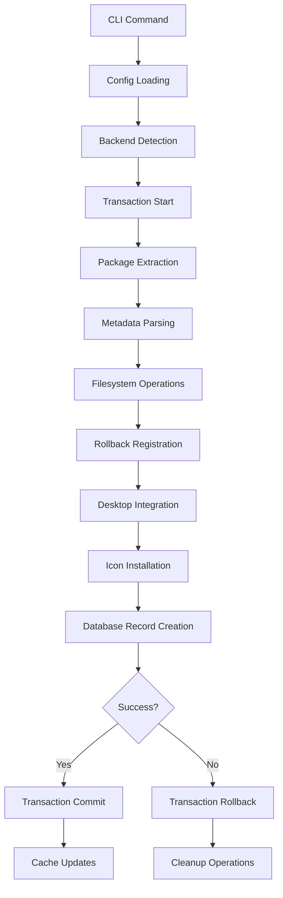
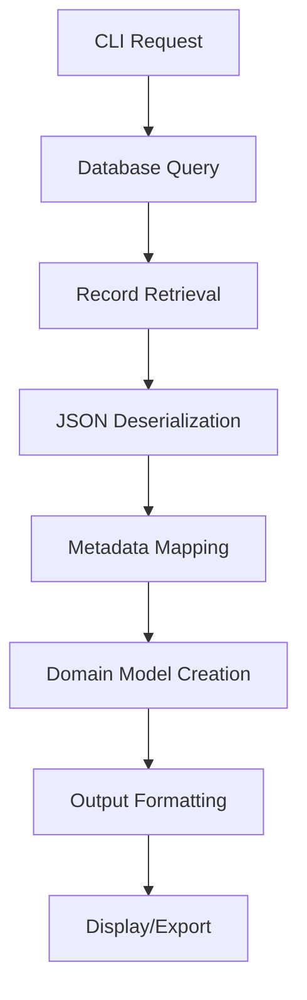
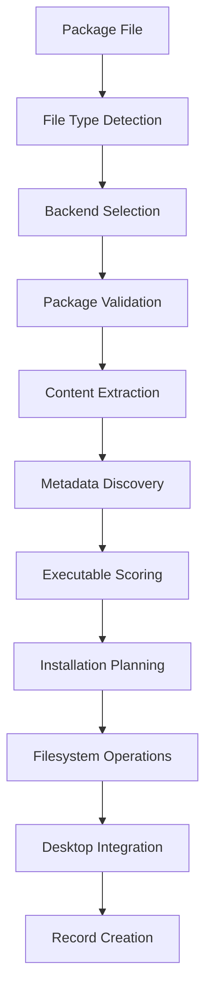

Based on my comprehensive analysis of the upkg codebase, I can now provide a detailed data flow analysis. Here's the complete documentation:

# Data Flow Analysis

## Data Models Overview

The upkg application uses a layered data model architecture with clear separation between domain models, data transfer objects, and configuration structures.

### Core Domain Models (`internal/core/models.go`)
- **`InstallRecord`**: Primary domain model representing an installed package with fields for `InstallID`, `PackageType`, `Name`, `Version`, `InstallDate`, `OriginalFile`, `InstallPath`, `DesktopFile`, and nested `Metadata`
- **`PackageType`**: Enum defining supported package formats (`deb`, `rpm`, `appimage`, `tarball`, `binary`, `zip`)
- **`Metadata`**: Nested structure containing `IconFiles`, `WrapperScript`, `WaylandSupport`, and `ExtractedMeta`
- **`DesktopEntry`**: Structure for parsing/generating `.desktop` files with INI format tags
- **`IconFile`**: Represents discovered icons with `Path`, `Size`, and `Ext` fields

### Configuration Models (`internal/config/config.go`)
- **`Config`**: Root configuration structure containing `PathsConfig`, `DesktopConfig`, and `LoggingConfig`
- **`PathsConfig`**: Defines data directory paths (`DataDir`, `DBFile`, `LogFile`)
- **`DesktopConfig`**: Desktop integration settings including Wayland environment variables and custom environment variables

### Database DTOs (`internal/db/db.go`)
- **`Install`**: Data transfer object for database operations, mirroring `InstallRecord` but using `map[string]interface{}` for `Metadata` to facilitate JSON serialization

### Heuristic Models (`internal/heuristics/models.go`)
- **`ExecutableScore`**: Used for ranking potential executable files within packages with `Path` and `Score` fields

## Data Transformation Map

Data undergoes multiple transformations throughout the application lifecycle:

### 1. Configuration Loading Flow
```
config.toml/Environment → viper.ReadInConfig() → viper.Unmarshal() → Config struct
```
- Path expansion via `expandPath()` handles `~` and environment variables
- Default values applied through `setDefaults()`

### 2. Package Detection Flow
```
Raw Package File → FileType Detection → Backend Selection → Metadata Extraction
```
- File type detection uses magic numbers and extensions (`internal/helpers/detection.go`)
- Backend registry (`internal/backends/backend.go`) routes to appropriate handler
- Each backend extracts package-specific metadata

### 3. Installation Data Flow
```
Package Contents → Backend Processing → InstallRecord Creation → DB DTO Mapping → JSON Serialization → Database Storage
```
- Transaction manager tracks all filesystem operations with rollback functions
- Metadata marshaled to JSON for database storage
- Desktop files parsed/modified using custom INI handlers

### 4. Retrieval Flow
```
Database Query → JSON Deserialization → DB DTO → Domain Model → CLI Output
```
- Metadata unmarshaled from JSON to `map[string]interface{}`
- Flexible output formats (table, JSON) for different use cases

## Storage Interactions

### Database Architecture
- **Technology**: SQLite with `modernc.org/sqlite` driver
- **Connection Strategy**: Separate read/write pools with write pool limited to 1 connection for SQLite write locking
- **Pragmas**: `journal_mode(WAL)`, `foreign_keys(1)`, `busy_timeout(5000)`

### Schema Design
```sql
CREATE TABLE installs (
    install_id TEXT PRIMARY KEY,
    package_type TEXT NOT NULL,
    name TEXT NOT NULL,
    version TEXT,
    install_date DATETIME DEFAULT CURRENT_TIMESTAMP,
    original_file TEXT NOT NULL,
    install_path TEXT NOT NULL,
    desktop_file TEXT,
    metadata TEXT  -- JSON serialized metadata
);
```

### Data Access Patterns
- **Create**: `db.Create()` - Inserts new installation records with JSON-serialized metadata
- **Read**: `db.Get()` and `db.List()` - Retrieves records with metadata deserialization
- **Delete**: `db.Delete()` - Removes installation records
- **Indexing**: Optimized queries on `name` and `package_type` fields

## Validation Mechanisms

### Multi-Layer Validation Strategy

#### 1. Input Validation (`internal/security/validation.go`)
- **Package Names**: Regex validation (`^[a-zA-Z0-9._-]+$`) with length limits and suspicious pattern detection
- **File Paths**: Path traversal prevention, null byte detection, and sensitive system path blocking
- **Versions**: Format validation with dangerous pattern filtering

#### 2. Configuration Validation
- TOML structure validation during unmarshaling
- Path resolution and expansion validation
- Environment variable override validation

#### 3. Transaction Integrity (`internal/transaction/manager.go`)
- Rollback function registration for all filesystem operations
- LIFO execution order for proper cleanup
- Atomic operations ensuring system consistency

#### 4. Backend-Specific Validation
- File type verification using magic numbers
- Package format validation per backend
- Executable validation for binary packages

## State Management Analysis

### Three-Tier State Architecture

#### 1. Persistent State
- **SQLite Database**: Long-term storage of installation records
- **Configuration Files**: TOML-based configuration with environment overrides
- **Filesystem**: Installed packages, desktop files, and icons

#### 2. Runtime State
- **Configuration Objects**: Immutable during execution
- **Backend Registry**: Initialized at startup, maintains backend instances
- **Logger Context**: Structured logging with request correlation

#### 3. Transactional State
- **Transaction Manager**: Short-lived state tracking installation operations
- **Rollback Stack**: LIFO collection of cleanup functions
- **Progress Tracking**: Installation phase management with hybrid progress bars/spinners

## Serialization Processes

### Multiple Serialization Formats

#### 1. Configuration (TOML)
- **Location**: `internal/config/config.go`
- **Process**: `viper` library handles TOML parsing and environment variable merging
- **Features**: Default values, path expansion, type-safe unmarshaling

#### 2. Database Storage (JSON)
- **Location**: `internal/db/db.go`
- **Process**: `json.Marshal()`/`json.Unmarshal()` for metadata column
- **Schema**: Flexible `map[string]interface{}` for extensible metadata

#### 3. Desktop Files (INI)
- **Location**: `internal/desktop/desktop.go`
- **Process**: Custom parsing with struct tags for field mapping
- **Features**: Wayland environment variable injection, validation

#### 4. CLI Output (Text/JSON)
- **Location**: `internal/cmd/*.go`
- **Process**: Multiple output formats for different use cases
- **Features**: Table formatting, JSON export, colored output

## Data Lifecycle Diagrams

### Installation Lifecycle


### Data Retrieval Flow


### Backend Processing Pipeline


This data flow analysis reveals a well-architected system with clear separation of concerns, robust validation, and comprehensive transaction management ensuring data integrity throughout the package management lifecycle.