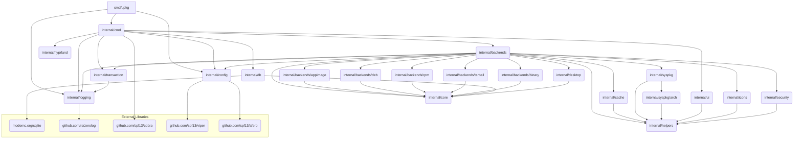

# Dependency Analysis
## Internal Dependencies Map

The project follows a layered architecture centered around the `internal` directory, with dependencies flowing from the entry point (`cmd/upkg`) down to core utilities and specific backends.

| Dependent Package | Dependencies (Internal) | Description |
| :--- | :--- | :--- |
| `cmd/upkg` (main) | `internal/cmd`, `internal/config`, `internal/logging` | Application entry point. Initializes configuration and logging, then executes the root command. |
| `internal/cmd` | `internal/config`, `internal/logging`, `internal/core`, `internal/backends`, `internal/db`, `internal/transaction`, `internal/hyprland`, `internal/ui` | Handles command-line parsing and execution. Subcommands are wired up here and depend on core services. |
| `internal/backends` | `internal/config`, `internal/core`, `internal/transaction`, `internal/cache`, `internal/desktop`, `internal/helpers`, `internal/icons`, `internal/security`, `internal/syspkg` | **Core Plugin System.** The `Registry` component manages all concrete package backends with high fan-out coupling. |
| `internal/transaction` | `internal/logging` | Provides the rollback mechanism for atomic package operations. |
| `internal/config` | `internal/security`, `internal/helpers` | Manages application configuration using Viper. |
| `internal/db` | `internal/core` | Manages the installation database using SQLite with separate read/write pools. |
| `internal/desktop` | `internal/core` | Handles desktop integration (creating `.desktop` files). |
| `internal/syspkg` | `internal/syspkg/arch`, `internal/helpers` | Provides abstraction layer for system package managers. |
| `internal/hyprland` | None | Hyprland compositor integration for window management. |
| `internal/cache` | `internal/helpers` | Updates system icon and desktop caches. |
| `internal/security` | None | Input validation and security utilities. |
| `internal/ui` | `internal/helpers` | User interface components (prompts, colors). |
| `internal/icons` | `internal/helpers` | Icon discovery and management. |
| `internal/heuristics` | `internal/core`, `internal/helpers` | Package type detection and scoring logic. |

## External Libraries Analysis

The project relies on a robust set of external Go libraries, primarily for CLI, configuration, logging, and file system operations.

| Library | Version | Category | Purpose |
| :--- | :--- | :--- | :--- |
| `github.com/spf13/cobra` | `v1.10.1` | CLI | Command-line interface framework. |
| `github.com/spf13/viper` | `v1.21.0` | Configuration | Application configuration management. |
| `github.com/spf13/afero` | `v1.15.0` | File System | Abstract file system operations. |
| `github.com/rs/zerolog` | `v1.34.0` | Logging | Fast, structured logging. |
| `github.com/schollz/progressbar/v3` | `v3.18.0` | UI/UX | Progress bars for operations. |
| `github.com/manifoldco/promptui` | `v0.9.0` | UI/UX | Interactive command-line prompts. |
| `github.com/fatih/color` | `v1.18.0` | UI/UX | Terminal color manipulation. |
| `github.com/olekukonko/tablewriter` | `v1.1.0` | UI/UX | Terminal table formatting. |
| `modernc.org/sqlite` | `v1.40.0` | Database | Embedded SQLite driver. |
| `github.com/ulikunitz/xz` | `v0.5.15` | Archive | XZ decompression support. |
| `layeh.com/asar` | `v0.0.0-20180124002634-bf07d1986b90` | Archive | ASAR archive support (Electron). |
| `gopkg.in/natefinch/lumberjack.v2` | `v2.2.1` | Logging | Log rotation and archiving. |
| `github.com/lithammer/fuzzysearch` | `v1.1.8` | Utility | Fuzzy string matching. |

## Service Integrations

The project integrates with several system-level components and external services.

| Integration Point | Internal Package | Type | Description |
| :--- | :--- | :--- | :--- |
| **Installation Database** | `internal/db` | Embedded Database | Uses `modernc.org/sqlite` with WAL mode and separate read/write pools for performance. |
| **System Package Managers** | `internal/syspkg`, `internal/syspkg/arch` | External Process | Abstracts interaction with native package managers (pacman for Arch Linux). |
| **Desktop Environment** | `internal/desktop`, `internal/cache` | System Files | Creates `.desktop` files and updates icon/desktop caches. |
| **Hyprland Compositor** | `internal/hyprland` | External Process | Window management integration for dock icon fixes. |
| **File System** | `github.com/spf13/afero` | Abstraction Layer | Abstracted file operations for testability and security. |
| **System Commands** | `internal/helpers` | External Process | Secure command execution with context and timeout handling. |

## Dependency Injection Patterns

The project primarily uses **Explicit Constructor Injection** with a factory pattern for component wiring.

1.  **Root Component Wiring:** The `main` function acts as the composition root, initializing core dependencies (`config`, `log`) and passing them to `cmd.NewRootCmd`.

2.  **Command Injection:** Subcommands receive dependencies via constructors:
    ```go
    func NewInstallCmd(cfg *config.Config, log *zerolog.Logger) *cobra.Command
    ```

3.  **Backend Registry Pattern:** The `backends.NewRegistry` function acts as a factory that instantiates all concrete backends:
    ```go
    registry.backends = append(registry.backends, deb.New(cfg, log))
    registry.backends = append(registry.backends, rpm.New(cfg, log))
    ```

4.  **Transaction Management:** The `transaction.Manager` is created within commands and passed to backend methods for atomic operations.

5.  **Provider Pattern:** System package management uses the Provider interface with concrete implementations like `arch.NewPacmanProvider()`.

## Module Coupling Assessment

The project exhibits a generally healthy dependency structure with intentional coupling patterns.

| Module | Cohesion | Coupling | Notes |
| :--- | :--- | :--- | :--- |
| **`internal/core`** | High | Low | Contains only interfaces and models - the least coupled package. |
| **`internal/backends`** | High | High (Fan-out) | Registry has high fan-out coupling to all backends - necessary for plugin system. |
| **`internal/cmd`** | High | Medium | Coupled to core services through constructor injection. |
| **`internal/db`** | High | Low | Highly cohesive persistence layer with minimal coupling. |
| **`internal/helpers`** | Low | High (Fan-in) | Utility package with high fan-in - typical for shared utilities. |
| **`internal/security`** | High | Low | Focused security utilities with minimal dependencies. |
| **`internal/hyprland`** | High | Low | Specific integration with minimal coupling. |

**Assessment:** The coupling is mostly controlled and follows dependency inversion principles. The high fan-out in `backends` is intentional for the plugin architecture.

## Dependency Graph



## Potential Dependency Issues

1.  **Backend Coupling to Utilities:** Concrete backends are coupled to many utility packages (`helpers`, `desktop`, `security`, `cache`, `icons`). Changes to these utilities could impact all backends.

2.  **Database Driver Lock-in:** The `internal/db` package is directly coupled to `modernc.org/sqlite` without interface abstraction, making database switching difficult.

3.  **High Fan-in on `internal/helpers`:** As a critical utility package, changes could have wide-ranging side effects across the codebase.

4.  **System Command Dependencies:** Heavy reliance on external system commands (`pacman`, `hyprctl`, `gtk-update-icon-cache`) creates platform-specific coupling points.

5.  **Transaction Scope:** The transaction manager is passed through multiple layers, potentially making the call stack complex and harder to trace.

6.  **Configuration Coupling:** Many components receive the full `config.Config` object when they might only need specific configuration sections, violating the interface segregation principle.