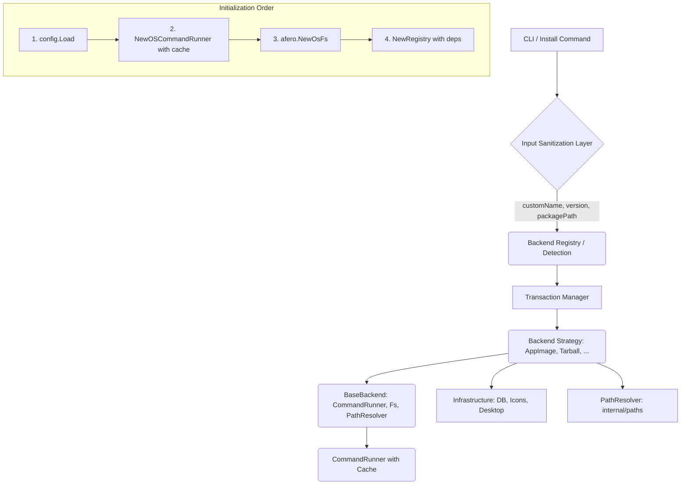
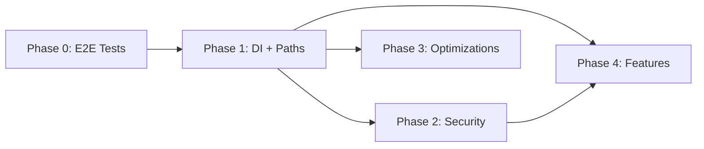

# Refactoring/Design Plan: Refatoração Abrangente e Implementação de Features (upkg)

## 1. Executive Summary & Goals

O objetivo deste plano é consolidar as melhorias estruturais, de eficiência, segurança e novas funcionalidades propostas em uma sequência lógica e de baixo risco. A prioridade máxima é a **Refatoração Core** (Injeção de Dependência) e a **Segurança**, que pavimentam o caminho para todas as outras otimizações e novos recursos.

### Key Goals:

1.  **Estabelecer a Injeção de Dependência Core:** Universalizar a injeção de `helpers.CommandRunner` e `afero.Fs` nos backends para garantir 100% de testabilidade e aderência ao `PLAN.md`.
2.  **Aumentar a Robustez e Segurança:** Centralizar a lógica de caminhos, aplicar sanitização de *todos* os inputs na camada CLI, e garantir validação de *output* em extrações.
3.  **Implementar Otimizações Chave:** Adicionar *caching* de comandos e aprimorar a extração ASAR nativa para ganhos imediatos de desempenho.

## 2. Current Situation Analysis

O projeto `upkg` possui uma arquitetura modular baseada no Padrão Estratégia (backends) e um Gerenciador de Transações (`internal/transaction/manager.go`).

### 2.1. Estado Atual Validado

| Aspecto | Status | Evidência |
|---------|--------|-----------|
| **CommandRunner injetado** | ✅ Implementado | Todos os backends têm `NewWithRunner()` |
| **afero.Fs injetado** | ❌ Não implementado | 20+ chamadas `os.*` só em `appimage.go` |
| **Lógica de paths duplicada** | ❌ Extensiva | 20+ padrões `filepath.Join()` idênticos |
| **Sanitização de customName** | ❌ Dispersa nos backends | Deveria estar na CLI |
| **Cache de CommandExists** | ❌ Inexistente | `exec.LookPath()` chamado toda vez |
| **Pacote security** | ✅ Bem desenvolvido | 10+ funções de validação disponíveis |
| **Funções security subutilizadas** | ❌ Sim | `copyDir()` não usa `ValidateSymlink()` |
| **Metadata.DesktopFiles** | ❌ Ausente | Apenas campo singular `DesktopFile` |

### 2.2. Pontos de Acoplamento Identificados

* **`internal/backends/appimage/appimage.go`**: `runner` é injetável, mas `os.*` é usado diretamente (~20 ocorrências: `os.Chmod`, `os.MkdirAll`, `os.Stat`, `os.Remove`, `os.WriteFile`).
* **`internal/backends/binary/binary.go`**: Similar ao AppImage.
* **`internal/backends/tarball/tarball.go`**: Similar, com lógica adicional de extração.
* **`internal/backends/deb/deb.go`**: Similar.
* **`internal/backends/rpm/rpm.go`**: Similar, com `copyDir()` contendo validação manual de symlinks.
* **`internal/config/config.go`**: Lógica de diretórios como `~/.local/bin` e `~/.local/share/applications` está duplicada em vários backends.
* **`internal/helpers/exec.go`**: A checagem de `CommandExists` não tem cache e chama `exec.LookPath` a cada invocação.
* **`internal/helpers/archive.go`**: Potencial vulnerabilidade de Path Traversal não auditada.

### 2.3. Inputs Não Sanitizados na CLI

```go
// internal/cmd/install.go - Estado atual
opts := core.InstallOptions{
    CustomName:  customName,   // ❌ Não sanitizado
    Version:     version,      // ❌ Não sanitizado
    PackagePath: packagePath,  // ❌ Não validado (path traversal risk)
}
```

## 3. Proposed Solution / Refactoring Strategy

A estratégia será o **Desenvolvimento Orientado por Habilitadores (Enabler-Driven Development)**, onde a refatoração de base é a primeira fase para habilitar as demais features com maior segurança e testabilidade.

### 3.1. High-Level Design / Architectural Overview

A injeção de dependência será universalizada e a lógica de caminhos será centralizada em um novo pacote.



### 3.2. Key Components / Modules

| Componente | Tipo | Responsabilidade / Mudança Principal |
|:-----------|:-----|:-------------------------------------|
| `internal/paths` (New) | Refatoração | Centralizar a lógica de `filepath.Join(homeDir, ...)` para `~/.local/bin`, `~/.local/share/applications`, etc. e validar permissões. |
| `internal/helpers/exec.go` | Otimização | Implementar `sync.Map` para cache de `CommandExists`. |
| `internal/backends/base.go` (New) | Refatoração | Criar `BaseBackend` struct com `afero.Fs`, `CommandRunner` e `PathResolver` injetados. |
| `internal/backends/*/*` | Refatoração | Migrar todos os backends para usar `BaseBackend` e eliminar chamadas diretas a `os.*`. |
| `internal/cmd/install.go` | Segurança | Sanitizar TODOS os inputs (`customName`, `version`, `packagePath`) antes de passar ao backend. |
| `internal/helpers/archive.go` | Segurança | Auditar e aplicar `security.ValidateExtractPath` consistentemente. |
| `internal/core/models.go` | Feature | Adicionar `DesktopFiles []string` ao `core.Metadata`. |

### 3.3. Detailed Action Plan / Phases

A ordem é estritamente sequencial, priorizando os habilitadores (`Enabler`), seguidos por Segurança/Organização e, por fim, as Features/Otimizações de Baixo Risco.

---

#### Phase 0: Baseline de Testes E2E (Pre-requisite)

**Objective(s):** Estabelecer uma suite de testes de integração para validar que refatorações não quebram funcionalidades.
**Priority:** Critical (Blocker para Phase 1)

| Task | Rationale/Goal | Effort | Deliverable/Criteria |
|:-----|:---------------|:-------|:---------------------|
| **0.1: Criar script de teste E2E** | Garantir que instalações/desinstalações reais funcionem antes e depois das mudanças. | M | Script em `scripts/e2e-test.sh` que usa `pkg-test/` para testar cada backend. |
| **0.2: Documentar baseline atual** | Capturar comportamento atual como referência. | S | Output do script salvo em `test-results/baseline.txt`. |

**Critérios de Sucesso:**
- Script executa install/uninstall para: AppImage, Binary, Tarball, DEB, RPM
- Verifica artefatos: binário em `~/.local/bin`, `.desktop` em `~/.local/share/applications`
- Exit code 0 = todos os testes passaram

---

#### Phase 1: Habilitadores e Refatoração Core (Enabler)

**Objective(s):** Injetar dependências de I/O e centralizar caminhos.
**Priority:** Critical

##### Sub-phase 1.1: Infraestrutura Base

| Task | Rationale/Goal | Effort | Deliverable/Criteria |
|:-----|:---------------|:-------|:---------------------|
| **1.1a: Criar `internal/paths/paths.go`** | Centralizar lógica de caminhos do sistema. | M | Funções `GetBinDir()`, `GetAppsDir()`, `GetIconsDir()`, `GetUpkgAppsDir()` implementadas. |
| **1.1b: Criar `internal/backends/base.go`** | Definir struct `BaseBackend` com dependências injetáveis. | M | `BaseBackend` struct com `Fs afero.Fs`, `Runner CommandRunner`, `Paths *paths.Resolver`. |

```go
// internal/backends/base.go - Design proposto
type BaseBackend struct {
    Fs     afero.Fs
    Runner helpers.CommandRunner
    Paths  *paths.Resolver
    Log    *zerolog.Logger
    Cfg    *config.Config
}

func NewBaseBackend(cfg *config.Config, log *zerolog.Logger) *BaseBackend {
    return &BaseBackend{
        Fs:     afero.NewOsFs(),
        Runner: helpers.NewOSCommandRunner(),
        Paths:  paths.NewResolver(cfg),
        Log:    log,
        Cfg:    cfg,
    }
}

func NewBaseBackendWithDeps(cfg *config.Config, log *zerolog.Logger, fs afero.Fs, runner helpers.CommandRunner) *BaseBackend {
    return &BaseBackend{
        Fs:     fs,
        Runner: runner,
        Paths:  paths.NewResolver(cfg),
        Log:    log,
        Cfg:    cfg,
    }
}
```

##### Sub-phase 1.2: Migração Incremental de Backends

**Estratégia:** Migrar um backend por vez, executando testes E2E após cada migração.

| Task | Rationale/Goal | Effort | Deliverable/Criteria |
|:-----|:---------------|:-------|:---------------------|
| **1.2a: Migrar Binary backend** | Backend mais simples, ideal para validar a abordagem. | M | `binary.go` usa `BaseBackend`, 0 chamadas diretas a `os.*`. |
| **1.2b: Migrar AppImage backend** | Backend com lógica moderada de FS. | M | `appimage.go` usa `BaseBackend`, 0 chamadas diretas a `os.*`. |
| **1.2c: Migrar Tarball backend** | Backend com extração complexa. | L | `tarball.go` usa `BaseBackend`, 0 chamadas diretas a `os.*`. |
| **1.2d: Migrar DEB backend** | Backend com dependência de `debtap`. | M | `deb.go` usa `BaseBackend`, 0 chamadas diretas a `os.*`. |
| **1.2e: Migrar RPM backend** | Backend mais complexo com `copyDir()`. | L | `rpm.go` usa `BaseBackend`, 0 chamadas diretas a `os.*`. |

**Checklist por Backend:**
- [ ] Substituir `os.Stat` → `b.Fs.Stat`
- [ ] Substituir `os.MkdirAll` → `b.Fs.MkdirAll`
- [ ] Substituir `os.Chmod` → `b.Fs.Chmod`
- [ ] Substituir `os.Remove` → `b.Fs.Remove`
- [ ] Substituir `os.RemoveAll` → `b.Fs.RemoveAll`
- [ ] Substituir `os.WriteFile` → `afero.WriteFile(b.Fs, ...)`
- [ ] Substituir `os.ReadFile` → `afero.ReadFile(b.Fs, ...)`
- [ ] Substituir `filepath.Join(homeDir, ".local", ...)` → `b.Paths.GetXxxDir()`
- [ ] Atualizar testes unitários para usar `afero.NewMemMapFs()`
- [ ] Executar `make validate`
- [ ] Executar `scripts/e2e-test.sh`

##### Sub-phase 1.3: Limpeza e Consolidação

| Task | Rationale/Goal | Effort | Deliverable/Criteria |
|:-----|:---------------|:-------|:---------------------|
| **1.3a: Remover lógica duplicada de paths** | Eliminar código morto após migração. | S | Grep por `filepath.Join.*\.local` em `internal/backends/*/*.go` retorna 0 resultados (excluindo `internal/backends/backend.go`). |
| **1.3b: Atualizar `NewRegistry()`** | Injetar dependências centralmente sem alterar prioridade. | S | `NewRegistry` aceita `fs` e `runner` opcionais, mantém a ordem atual de backends e tem teste garantindo essa ordem. |

---

#### Phase 2: Segurança e Robustez (Safety & Robustness)

**Objective(s):** Aplicar sanitização de input na camada CLI e reforçar a validação de *output* da extração/cópia.
**Priority:** High

| Task | Rationale/Goal | Effort | Deliverable/Criteria |
|:-----|:---------------|:-------|:---------------------|
| **2.1a: Sanitização de `customName`** | Prevenir injeção de caracteres especiais. | S | `customName` passa por `security.SanitizeString` + `security.ValidatePackageName` em `install.go`. |
| **2.1b: Validação de `version`** | Prevenir versões maliciosas. | S | `version` passa por `security.ValidateVersion` em `install.go`. |
| **2.1c: Validação de `packagePath`** | Prevenir path traversal na entrada. | S | `packagePath` é convertido para path absoluto e validado com `security.ValidatePath`. |
| **2.2a: Refatorar `rpm.go:copyDir`** | Usar funções centralizadas de segurança. | M | `copyDir` usa `security.ValidateExtractPath` e `security.ValidateSymlink`. |
| **2.2b: Auditar `helpers/archive.go`** | Garantir que extração de arquivos é segura. | M | Relatório de auditoria documentando uso de `security.*` ou gaps encontrados. |
| **2.2c: Consolidar lógica de extração segura** | Criar helper reutilizável. | M | Função `helpers.SafeExtract()` ou similar que encapsula validações de segurança. |
| **2.3: Reforço no Tratamento de Erros de Rollback** | Garantir que falhas de rollback são visíveis. | S | Mensagem de erro enfática em `install.go` se `tx.Rollback()` falhar. |

**Exemplo de Implementação (Task 2.1a-c):**

```go
// internal/cmd/install.go - RunE (início)
func runInstall(cmd *cobra.Command, args []string) error {
    packagePath := args[0]

    // 2.1c: Validar e normalizar packagePath
    absPath, err := filepath.Abs(packagePath)
    if err != nil {
        return fmt.Errorf("invalid package path: %w", err)
    }
    if err := security.ValidatePath(absPath); err != nil {
        return fmt.Errorf("package path validation failed: %w", err)
    }
    packagePath = absPath

    // 2.1a: Sanitizar customName
    if customName != "" {
        customName = security.SanitizeString(customName)
        if err := security.ValidatePackageName(customName); err != nil {
            return fmt.Errorf("invalid custom name: %w", err)
        }
    }

    // 2.1b: Validar version
    if version != "" {
        if err := security.ValidateVersion(version); err != nil {
            return fmt.Errorf("invalid version: %w", err)
        }
    }

    // ... resto da lógica
}
```

---

#### Phase 3: Otimizações de Desempenho e Ferramentas (Efficiency & Tools)

**Objective(s):** Melhorar a eficiência e a usabilidade para o desenvolvedor.
**Priority:** Medium

| Task | Rationale/Goal | Effort | Deliverable/Criteria |
|:-----|:---------------|:-------|:---------------------|
| **3.1: Cache de Comando** | Evitar chamadas repetidas a `exec.LookPath`. | M | `CommandExists` usa `sync.Map` para cache. |
| **3.2: Otimização de Query DEB** | Priorizar busca no `tmpDir` para pacotes gerados. | S | Busca pelo pacote Arch gerado prioriza o diretório temporário. |
| **3.3: Melhoria do `Makefile`** | Adicionar alvos úteis. | S | `make clean-db` e `make e2e-test` adicionados. |

**Design do Cache (Task 3.1):**

```go
// internal/helpers/exec.go
type OSCommandRunner struct {
    commandCache sync.Map // map[string]bool
}

func (r *OSCommandRunner) CommandExists(name string) bool {
    // Check cache first
    if cached, ok := r.commandCache.Load(name); ok {
        return cached.(bool)
    }

    // Cache miss: call exec.LookPath
    _, err := exec.LookPath(name)
    exists := err == nil

    // Store in cache (no invalidation needed for CLI session)
    r.commandCache.Store(name, exists)

    return exists
}
```

**Notas de Design:**
- **Thread-safety:** `sync.Map` é thread-safe por design
- **Invalidação:** Não necessária - sessão CLI é efêmera
- **Overhead:** Mínimo - apenas um map lookup adicional

---

#### Phase 4: Novas Funcionalidades e Modularização (Features & Modularity)

**Objective(s):** Adicionar funcionalidades solicitadas e aumentar a modularidade.
**Priority:** Low/Medium

| Task | Rationale/Goal | Effort | Deliverable/Criteria |
|:-----|:---------------|:-------|:---------------------|
| **4.1: Extração ASAR Nativa Otimizada** | Reduzir I/O em disco. | M | Extração de ícones ASAR usa `entry.Open()` diretamente. |
| **4.2: Modularização AppImage** | Reduzir acoplamento. | M | Funções do `appimage.go` são menos acopladas à struct. |
| **4.3a: Adicionar `DesktopFiles` ao Metadata** | Suportar múltiplos `.desktop`. | S | `core.Metadata` tem campo `DesktopFiles []string`. |
| **4.3b: Atualizar serialização JSON** | Persistir novo campo. | S | `internal/db` serializa/deserializa `DesktopFiles`. |
| **4.3c: Popular `DesktopFiles` nos backends** | Capturar todos os `.desktop` instalados. | M | DEB e RPM populam `DesktopFiles` durante instalação. |
| **4.3d: Atualizar `Uninstall()` para múltiplos `.desktop`** | Remover todos os arquivos. | M | `Uninstall` itera sobre `DesktopFiles` e remove cada um. |
| **4.3e: Migração de registros antigos** | Compatibilidade retroativa. | S | Registros sem `DesktopFiles` usam `DesktopFile` singular como fallback. |
| **4.4: Melhoria do Relatório de Integridade** | Diagnóstico mais detalhado. | S | `doctor -v` lista arquivos faltantes especificamente. |
| **4.5: Suporte a ZIP/Tarball de Binário Único** | Simplificar wrapper quando aplicável. | S | `TarballBackend` detecta e usa wrapper simplificado. |
| **4.6: Melhoria da Detecção de Tipo** | Erro mais claro para Flatpak/Snap. | S | `DetectBackend` sugere gerenciador nativo. |

##### 4.7. Data Model Changes (Detalhes das Tasks 4.3a-e)

#### `internal/core/models.go` (Struct `Metadata`)

```go
type Metadata struct {
    // Existing fields...
    IconFiles           []string          `json:"icon_files,omitempty"`
    WrapperScript       string            `json:"wrapper_script,omitempty"`
    WaylandSupport      string            `json:"wayland_support,omitempty"`
    InstallMethod       string            `json:"install_method,omitempty"`
    ExtractedMeta       ExtractedMetadata `json:"extracted_metadata,omitempty"`
    OriginalDesktopFile string            `json:"original_desktop_file,omitempty"`

    // NEW: Track all desktop files for complex packages (DEB/RPM)
    DesktopFiles        []string          `json:"desktop_files,omitempty"`
}
```

#### Migração de Dados

Registros existentes no DB não terão `DesktopFiles`. A lógica de leitura deve:

```go
// internal/db/db.go ou onde InstallRecord é usado
func (r *InstallRecord) GetDesktopFiles() []string {
    if len(r.Metadata.DesktopFiles) > 0 {
        return r.Metadata.DesktopFiles
    }
    // Fallback para campo singular (retrocompatibilidade)
    if r.DesktopFile != "" {
        return []string{r.DesktopFile}
    }
    return nil
}
```

##### 4.8. API Design / Interface Changes (Detalhes das Tasks 3.1 e 4.x)

#### `internal/helpers/exec.go`

```go
// helpers.CommandRunner permanece inalterada (ver internal/helpers/exec.go)
// Apenas a implementação padrão ganha cache interno para CommandExists.
type OSCommandRunner struct {
    commandCache sync.Map // map[string]bool
}
```

#### `internal/backends/base.go` (Novo)

```go
type BaseBackend struct {
    Fs     afero.Fs
    Runner helpers.CommandRunner
    Paths  *paths.Resolver
    Log    *zerolog.Logger
    Cfg    *config.Config
}
```

#### `internal/paths/paths.go` (Novo)

```go
type Resolver struct {
    homeDir string
    cfg     *config.Config
}

func NewResolver(cfg *config.Config) *Resolver
func (r *Resolver) GetBinDir() string           // ~/.local/bin
func (r *Resolver) GetAppsDir() string          // ~/.local/share/applications
func (r *Resolver) GetIconsDir() string         // ~/.local/share/icons/hicolor
func (r *Resolver) GetUpkgAppsDir() string      // ~/.local/share/upkg/apps
func (r *Resolver) GetIconSizeDir(size string) string  // ~/.local/share/icons/hicolor/{size}/apps
```

## 4. Key Considerations & Risk Mitigation

### 4.1. Technical Risks & Challenges

| Risco | Descrição | Probabilidade | Impacto | Mitigação |
|:------|:----------|:--------------|:--------|:----------|
| **Regressão de I/O** | Migração de `os.*` para `afero.Fs` pode quebrar funcionalidades. | Média | Alto | Testes E2E antes/depois de cada backend (Phase 0). |
| **Escopo da Migração** | ~150+ assinaturas de método precisam mudar. | Alta | Médio | Migração incremental por backend (Phase 1.2a-e). |
| **Incompatibilidade de Paths** | Lógica de paths pode divergir entre backends. | Baixa | Alto | Validar com testes E2E após Task 1.3a. |
| **Cache Stale** | Se usuário instalar ferramenta durante sessão. | Muito Baixa | Baixo | Aceitar: sessão CLI é curta, reiniciar resolve. |
| **Migração de DB** | Registros antigos sem `DesktopFiles`. | Média | Baixo | Fallback para campo singular (Task 4.3e). |

### 4.2. Dependencies



- **Phase 0 é blocker:** Não iniciar Phase 1 sem baseline de testes
- **Phase 1 é pré-requisito:** Phase 2, 3, 4 dependem da infraestrutura de DI
- **Phase 2 pode rodar em paralelo com Phase 3**
- **Phase 4 depende de Phase 1 e parcialmente de Phase 2**

### 4.3. Non-Functional Requirements (NFRs) Addressed

| NFR | Phase | Como é Endereçado |
|:----|:------|:------------------|
| **Testabilidade** | Phase 1 | 100% dos backends testáveis com `afero.NewMemMapFs()` |
| **Segurança (Input)** | Phase 2 | Sanitização centralizada na CLI |
| **Segurança (Path Traversal)** | Phase 2 | Uso consistente de `security.ValidateExtractPath` |
| **Performance** | Phase 3 | Cache de `CommandExists`, otimização ASAR |
| **Usabilidade** | Phase 4 | `doctor -v` com diagnóstico detalhado |
| **Manutenibilidade** | Phase 1 | Lógica de paths centralizada, DI universal |

## 5. Success Metrics / Validation Criteria

### Métricas Quantitativas

| Métrica | Target | Como Verificar |
|:--------|:-------|:---------------|
| Chamadas `os.*` nos pacotes de backend específicos | 0 | `grep -r "os\." internal/backends/*/*.go \| grep -v "_test.go" \| wc -l` |
| Duplicação de path logic | 0 | `grep -r "filepath.Join.*\.local" internal/backends/*/*.go \| wc -l` |
| Code coverage em backends | ≥80% | `go test -cover ./internal/backends/...` |
| Tempo de `CommandExists` (cached) | <1ms | Benchmark test |
| Testes E2E passando | 100% | `scripts/e2e-test.sh` exit code 0 |

### Métricas Qualitativas

- Todos os backends (`internal/backends/*`) utilizam `BaseBackend` com `afero.Fs` e `helpers.CommandRunner` injetados.
- A lógica de caminhos do sistema é abstraída e unificada no pacote `internal/paths`.
- As funções de extração (`rpm.go:copyDir`, `internal/helpers/archive.go`) implementam checagens de Path Traversal via `security.*`.
- `internal/cmd/install.go` sanitiza `customName`, `version` e `packagePath` antes de chamar o backend.
- Registros de instalação rastreiam múltiplos `.desktop` files via `Metadata.DesktopFiles`.

## 6. Assumptions Made

1. O escopo da injeção de `afero.Fs` está limitado aos pacotes de backend (`internal/backends/*/`) e seus helpers internos de arquivo; `internal/backends/backend.go` pode manter `os.Open` para detecção de tipo.
2. Não é necessário introduzir um pattern de Factory para `CommandRunner` e `Fs` nos construtores - basta ter `New()` (padrão) e `NewWithDeps()` (injetável).
3. O cache de `CommandExists` não precisa de invalidação porque a sessão CLI é efêmera.
4. Registros existentes no DB podem não ter `DesktopFiles` e precisam de fallback.
5. O diretório `pkg-test/` contém pacotes de teste representativos para cada backend.

## 7. Open Questions / Areas for Further Investigation

| # | Questão | Status | Impacto |
|:--|:--------|:-------|:--------|
| 1 | O `internal/icons/icons.go` usa `afero.Fs` ou `os.*`? | A investigar | Pode precisar refatoração |
| 2 | O `internal/helpers/archive.go` já tem validação de Path Traversal? | A auditar (Task 2.2b) | Segurança |
| 3 | Existem outros pontos de entrada além de `install.go` que precisam sanitização? | A investigar | Segurança |
| 4 | O campo `DesktopFile` (singular) em `InstallRecord` pode ser deprecated? | A decidir | Migração de schema |

## 8. Appendix: Ordem de Execução Recomendada

```
Week 1-2: Phase 0 (E2E baseline)
Week 3-4: Phase 1.1 (Infraestrutura: paths.go, base.go)
Week 5-6: Phase 1.2a-b (Binary + AppImage)
Week 7-8: Phase 1.2c-e (Tarball + DEB + RPM)
Week 9: Phase 1.3 (Limpeza)
Week 10: Phase 2.1 (Input sanitization)
Week 11: Phase 2.2-2.3 (Output validation + Rollback)
Week 12: Phase 3 (Optimizations)
Week 13-14: Phase 4 (Features)
```

**Nota:** Semanas são indicativas de sequenciamento, não estimativas de tempo. O esforço real depende da disponibilidade e complexidade encontrada.
